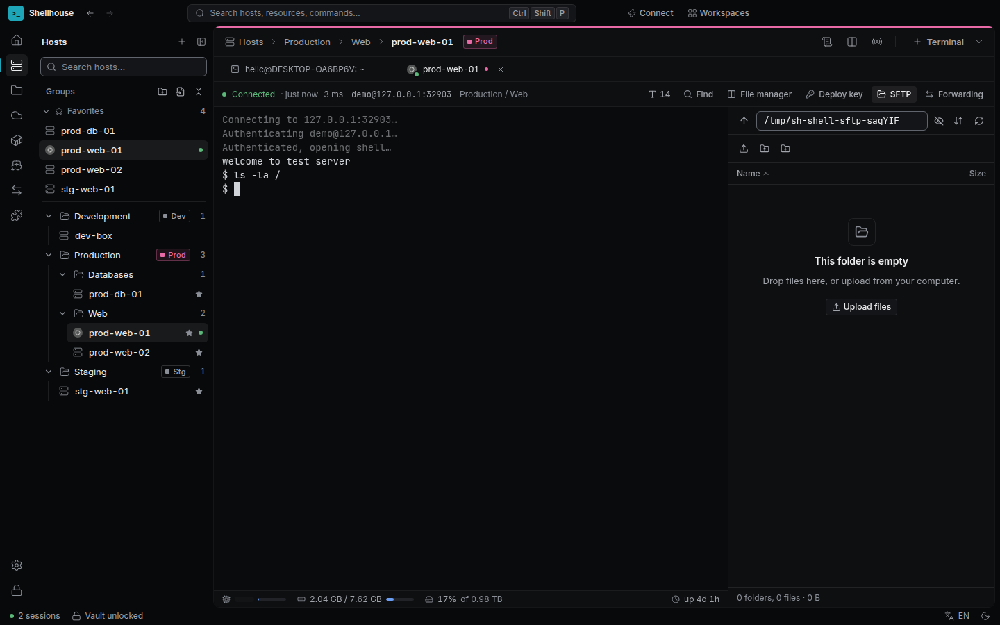
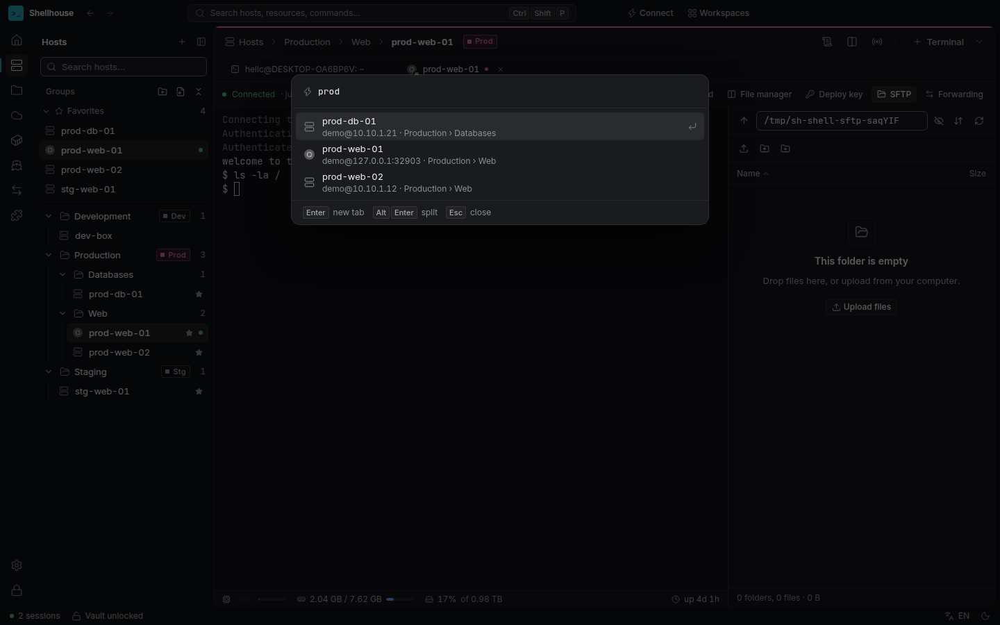
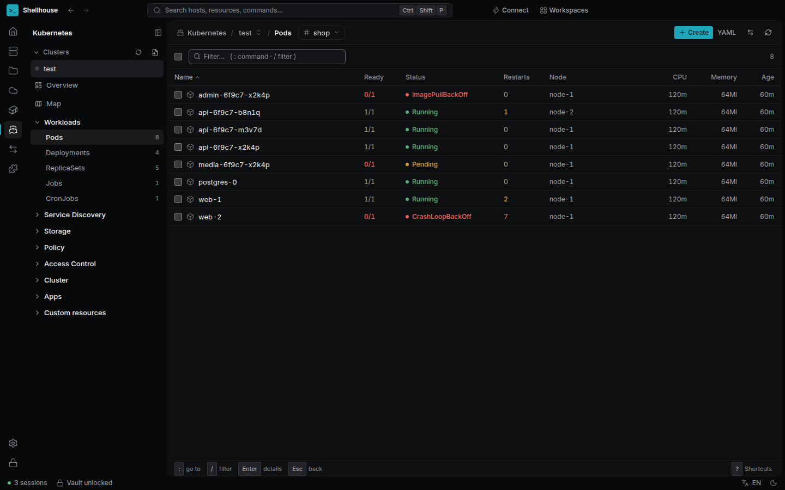
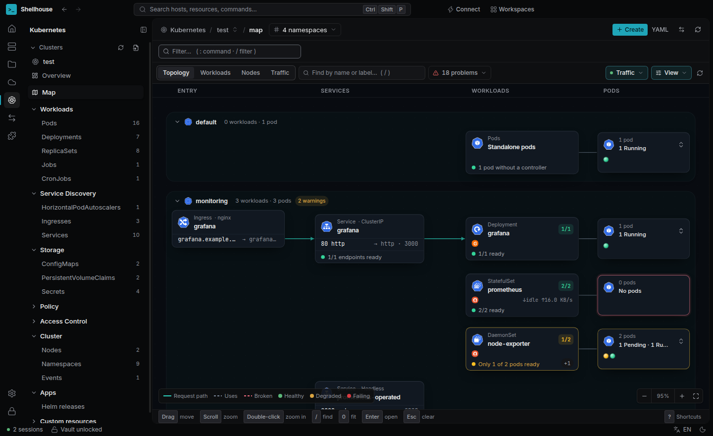
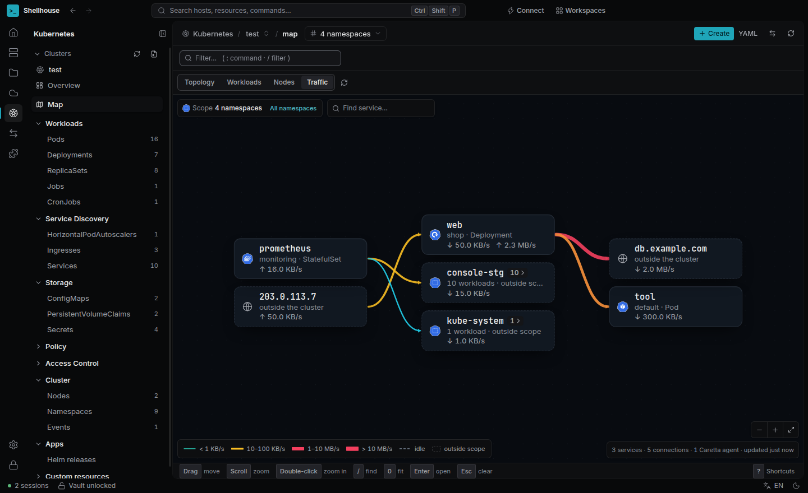
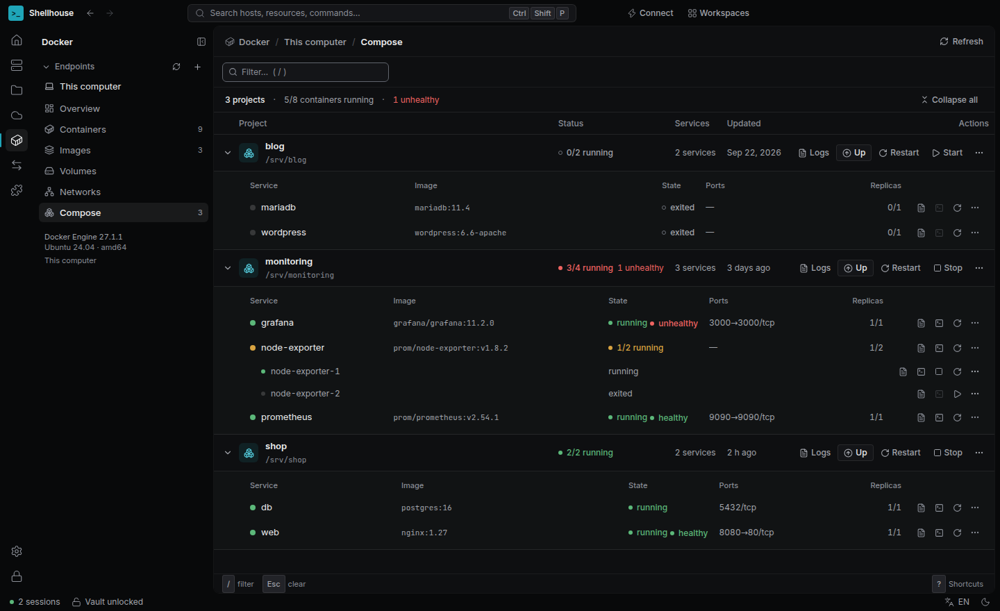

# Shellhouse

**A desktop workspace for people who run servers.** SSH, SFTP, Kubernetes, Docker, S3 and Remote
Desktop in one app, organised around the thing that matters most in operations: _which environment
am I touching right now?_

Electron · TypeScript · React · xterm.js · ssh2 · libsodium — Windows, macOS and Linux.



---

## Why

A typical ops day jumps between a terminal client, an SFTP client, `kubectl`/k9s, Docker Desktop,
an S3 browser and mstsc. Each tool has its own host list, its own credentials and its own idea of
"production". Shellhouse keeps one inventory and one encrypted vault, and tags every host, cluster,
Docker endpoint and cloud account with an **environment** (Prod / Staging / Dev…). The environment
colour follows you into tabs, breadcrumbs and confirmations, so a production session never looks
like a staging one.

## Features

**Terminal & SSH**

- SSH, local shells (PowerShell, cmd, WSL, bash, zsh), Telnet, serial and RDP in tabs and split
  panes; saved workspaces.
- Password, key (with passphrase), agent / Pageant and keyboard-interactive (OTP / 2FA) logins.
- Multi-hop ProxyJump, strict host-key checking (TOFU, `@revoked`, changed-key warnings).
- Local / remote / dynamic (SOCKS5) port forwarding.
- SFTP side panel with a transfer queue, resumable transfers and atomic saves for remote edits.
- Quick connect (`user@host:port` or a pasted `ssh -J …` command), command palette, snippets,
  multi-exec (broadcast input).

**Hosts & secrets**

- Nested groups with inherited settings and environments, favourites, bulk actions.
- Import from `~/.ssh/config`, MobaXterm, Termius, CSV and `.rdp` files; export / import.
- Vault: master password, Argon2id + XChaCha20-Poly1305, optional "remember on this device" through
  the OS keychain, auto-lock.
- Keychain: reusable accounts and SSH keys (generate, import, deploy to a server).

**Modules** (opt-in)

- **Kubernetes** — talks to the API server directly (no `kubectl` needed). Resource browser, YAML
  editing, logs / exec / port-forward, Helm releases, plus a cluster **Topology** (Ingress →
  Service → Workload → Pod) and a live **Traffic** service map.
- **Docker** — local or over SSH; containers, images, volumes, networks, Compose projects, bulk
  actions. Engine API with a CLI fallback.
- **S3** — AWS S3, MinIO, Wasabi, Cloudflare R2: buckets, objects, folder sync.
- **Remote Desktop** — RDP inside a tab (IronRDP, or Microsoft's own engine on Windows), optionally
  tunnelled through an SSH host, or handed to the system client.

**Everything else:** light / dark themes, English and Vietnamese UI, keyboard-first navigation,
signed auto-updates with beta / stable channels.

## Screenshots

| Quick connect                                     | Kubernetes resources                         |
| ------------------------------------------------- | -------------------------------------------- |
|    |  |
| **Kubernetes topology**                           | **Kubernetes traffic map**                   |
|          |       |
| **Docker Compose**                                |                                              |
|  |                                              |

## Architecture

```
┌────────────────────────┐   invoke (zod-validated)   ┌──────────────────────────────┐
│ Renderer (sandboxed)   │ ─────────────────────────▶ │ Main                         │
│ React UI, xterm.js     │                            │ windows, IPC router, vault,  │
│ no Node access         │ ◀──────── events ───────── │ SQLite, updater, supervisor  │
└──────────┬─────────────┘                            └──────────────┬───────────────┘
           │ MessagePort (terminal bytes,                            │ spawns, pings,
           │ direct, with backpressure)                              │ restarts on crash / hang
           ▼                                                         ▼
┌──────────────────────────────────────────────────────────────────────────────────────┐
│ Session Host (utilityProcess)                                                        │
│ SSH · PTY · SFTP · forwarding · Telnet / serial · RDP proxy · Docker / K8s / S3      │
└──────────────────────────────────────────────────────────────────────────────────────┘
```

- **Fault isolation.** All network and PTY work lives in a separate process. If it crashes or
  hangs, the supervisor restarts it with backoff and the UI stays up (covered by an E2E test).
- **One API surface.** The renderer only sees the functions exposed through `contextBridge`. Every
  message crossing a process boundary is validated with a shared zod schema and checked against
  its sender.
- **Enforced boundaries.** ESLint forbids imports between process folders; only `src/shared` is
  common.
- **Modules** (Kubernetes, Docker, S3) plug into a registry with their own IPC, storage and UI, and
  can be turned off entirely.

```
src/main/          main process: windows, security, IPC, supervisor, vault, store
src/session-host/  utilityProcess: SSH, PTY, SFTP, forwarding, RDP
src/preload/       contextBridge — the only API the renderer can see
src/renderer/      React UI
src/shared/        IPC contracts + zod schemas shared by every process
src/node-shared/   Node-only helpers (secrets, host keys, UUIDv7) for main + Session Host
src/modules/       Kubernetes, Docker, S3 modules and their registry
migrations/        SQL migrations (append-only)
```

## Engineering highlights

- **Security by construction.** Electron fuses locked down, sandboxed renderer, locked-down
  navigation policy. Secrets are encrypted per field (DEK/KEK, associated data bound to table / row /
  column) with libsodium; no hand-rolled crypto. Remote commands are built as argv with explicit
  quoting, never as shell strings. See [SECURITY.md](SECURITY.md) and
  [docs/security-review.md](docs/security-review.md).
- **Tested against real servers.** A Docker matrix runs the SSH stack against OpenSSH 7.4, 8.2, 9.6
  and latest, Dropbear, a legacy CentOS 7 server, TOTP keyboard-interactive and a three-hop bastion
  chain, nightly in CI.
- **A full test pyramid**, about 1,150 unit and integration tests plus:
  - fast-check fuzzing for every parser that reads untrusted input;
  - Playwright E2E against the real Electron app on Windows, macOS and Linux;
  - nightly soak tests that track memory and handle leaks;
  - smoke tests on the packaged build (fuses, asar, native modules).
- **Decisions written down.** 15 [Architecture Decision Records](docs/adr/) cover the process model,
  the terminal stream protocol, auth and secrets, the module system and the design system.
- **Safe data handling.** Migrations run in a transaction with a backup first and refuse a newer
  schema; remote file saves go to a temp file and are renamed atomically.
- **Release engineering.** electron-builder installers for all three platforms, signed update
  channels and a changelog-driven release workflow ([docs/RELEASING.md](docs/RELEASING.md)).

## Development

Requirements: Node.js 24 LTS, pnpm 12 (`corepack enable`) and a C++ toolchain for `node-pty`:

- Linux / WSL: `sudo apt install build-essential python3`
- macOS: `xcode-select --install`
- Windows: Visual Studio Build Tools ("Desktop development with C++")

```bash
pnpm install
pnpm rebuild:native   # build node-pty for Electron's ABI
pnpm dev
```

| Command                                              | What it does                                                                  |
| ---------------------------------------------------- | ----------------------------------------------------------------------------- |
| `pnpm dev`                                           | Run the app with hot reload                                                   |
| `pnpm lint` / `pnpm typecheck` / `pnpm format:check` | Static checks                                                                 |
| `pnpm test`                                          | Unit + integration + quick fuzz (Vitest)                                      |
| `pnpm fuzz`                                          | Parser fuzzing, 50,000 runs per property                                      |
| `pnpm test:compat`                                   | Real SSH server matrix (Docker): OpenSSH 7.4→10, Dropbear, legacy, TOTP, jump |
| `pnpm build && pnpm test:e2e`                        | E2E on the real Electron app (Playwright)                                     |
| `pnpm build && pnpm bench`                           | Throughput / latency / RAM benchmarks                                         |
| `pnpm build && SOAK_MINUTES=60 pnpm soak`            | Soak test: mixed load, memory / handle leak tracking                          |
| `pnpm build && pnpm screens`                         | Regenerate UI screenshots into `screens/`                                     |
| `pnpm package:dir && pnpm test:package`              | Unsigned package in `dist/`, then smoke-test it                               |
| `pnpm package`                                       | Full installers (AppImage / deb / rpm, NSIS, dmg / zip)                       |

Changelog: [CHANGELOG.md](CHANGELOG.md).
